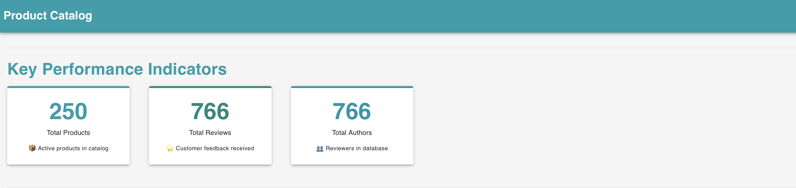
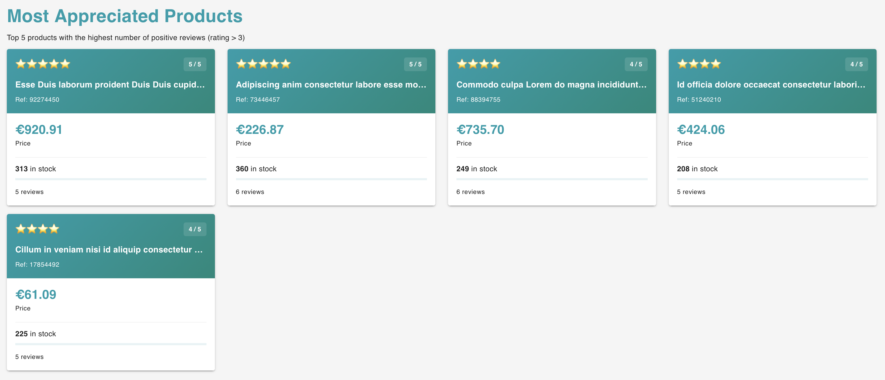
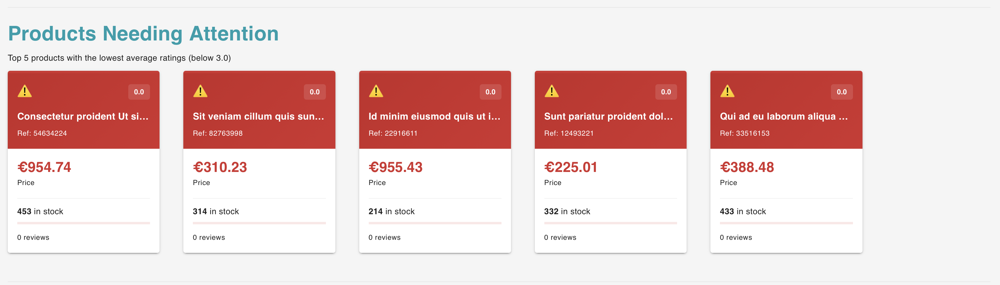
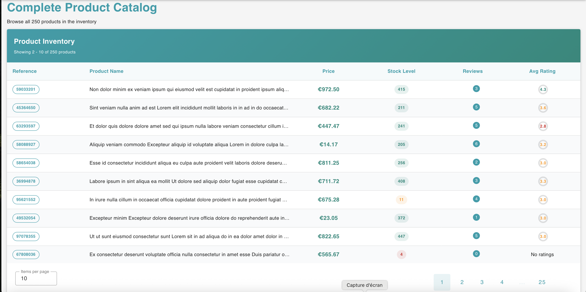

## Project Structure

This is a monorepo with the following structure:

```
product-catalog/
├── packages/
│   ├── api/          # NestJS backend
│   └── web/          # Vue 3 frontend
├── data/
│   └── products.json # Product catalog data
├── docker-compose.yml
└── package.json      # Root monorepo configuration
```


## Prerequisites

- Node.js 22 LTS
- Docker & Docker Compose (for containerized setup)
- PostgreSQL 16+ (if running locally)


## Quick Start

### 1. Setup Environment Variables

```bash
cp .env.example .env
```


### 2. Install Dependencies

```bash
npm run install:all
```

This command installs dependencies in root, api, and web packages.

### 3. Local Development (without Docker)

#### Start PostgreSQL

```bash
npm run db:up
```

Or manually:

```bash
docker-compose up -d postgres
```

#### Stop PostgreSQL

```bash
npm run db:down
```

#### Run Database Migrations

```bash
npm run migrate
```

This command runs all migrations, which will create the schema and insert data from `data/products.json`.

#### Start Both API and Web in Parallel

From root directory:

```bash
npm run dev
```

This starts:
- API on `http://localhost:3000`
- Web on `http://localhost:5173`

### 4. Production with Docker

Build and run everything with Docker Compose:

```bash
npm start
```

Or manually:

```bash
docker-compose up --build
```

Access:
- API: `http://localhost:3000`
- Web: `http://localhost:5173`


## API Documentation

### Base URL

```
http://localhost:3000

```

### Swagger UI Documentation

```
http://localhost:3000/api/docs

```

### Endpoints

#### Products

- `GET /api/products` - Get all products (with pagination)
- `GET /api/products/:id` - Get product by ID
- `GET /api/products/reference/:reference` - Get product by reference

Query parameters:
- `skip` - Number of records to skip (default: 0)
- `take` - Number of records to return (default: undefined)

#### Reviews

- `GET /api/reviews` - Get all reviews (with pagination)
- `GET /api/reviews/product/:productId` - Get reviews for a product

Query parameters:
- `skip` - Number of records to skip
- `take` - Number of records to return

#### Authors

- `GET /api/authors` - Get all authors (with pagination)
- `GET /api/authors/:id` - Get author by ID

Query parameters:
- `skip` - Number of records to skip
- `take` - Number of records to return


## App layout





